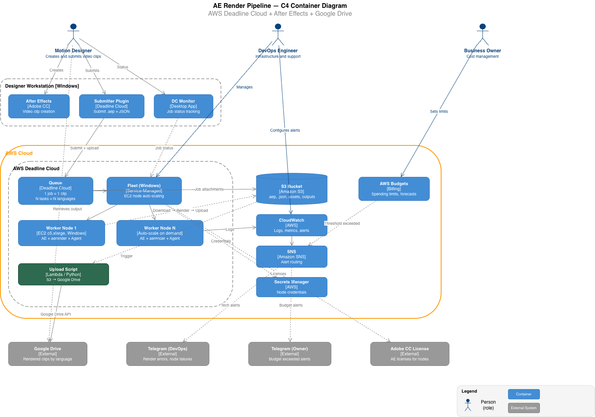

# C4 Diagram Skill for Claude Code

Generate [C4 Container diagrams](https://c4model.com/) (Simon Brown's standard) as editable `.drawio` files directly from Claude Code conversations.

## What It Does

- Generates **C4 Container-level** architecture diagrams
- Outputs **editable .drawio XML** (opens in [draw.io](https://app.diagrams.net/) desktop or web)
- Follows the official C4 color scheme and notation
- Strict **layered layout**: Person → System Boundary → External Systems
- Every element gets **explicit coordinates** (no auto-layout drift)
- **Legend included** on every diagram
- Solid arrows = synchronous, dashed = asynchronous

## Example

Ask Claude Code:

```
/c4-diagram

Draw a C4 container diagram for an e-commerce system with:
- Web app (React), mobile app (Flutter)
- API gateway (Node.js)
- Order service, payment service (Python)
- PostgreSQL database, Redis cache
- External: Stripe payments, SendGrid email
```

Claude generates a `.drawio` file you can open and edit in [draw.io](https://app.diagrams.net/):



*Real output: AWS Deadline Cloud render pipeline with 3 persons, 2 system boundaries, 14 containers, 4 external systems.*

## Installation

### Option 1 — install as a plugin (recommended)

Type these inside Claude Code:

```
/plugin marketplace add aleksnikolaev/c4-diagram-skill
/plugin install c4-diagram@c4-diagram-skill
```

The `owner/repo` shorthand clones over SSH. If you don't have SSH keys set up on GitHub, use the full HTTPS URL instead:

```
/plugin marketplace add https://github.com/aleksnikolaev/c4-diagram-skill.git
```

To pull updates later: `/plugin marketplace update c4-diagram-skill`

### Option 2 — copy the skill by hand

The skill lives in `skills/c4-diagram/`. Copy **that directory**, not the repository root — `SKILL.md` has to sit directly inside the skill folder.

Personal install, available in all your projects:

```bash
git clone https://github.com/aleksnikolaev/c4-diagram-skill.git
mkdir -p ~/.claude/skills
cp -r c4-diagram-skill/skills/c4-diagram ~/.claude/skills/c4-diagram
```

Single project only:

```bash
git clone https://github.com/aleksnikolaev/c4-diagram-skill.git
mkdir -p .claude/skills
cp -r c4-diagram-skill/skills/c4-diagram .claude/skills/c4-diagram
```

Either way you should end up with `SKILL.md` at `~/.claude/skills/c4-diagram/SKILL.md` (or `.claude/skills/c4-diagram/SKILL.md`).

### Using it

Run `/c4-diagram` in Claude Code, or just describe your system — Claude loads the skill on its own when a diagram would help.

## File Structure

```
c4-diagram-skill/
├── .claude-plugin/
│   ├── marketplace.json            # Marketplace catalog entry
│   └── plugin.json                 # Plugin manifest
├── skills/
│   └── c4-diagram/
│       ├── SKILL.md                # Main skill definition
│       └── references/
│           ├── element-templates.md    # XML templates for each C4 element
│           ├── drawio-template.md      # Base .drawio file structure
│           └── legend-template.md      # Legend XML template
├── examples/
│   ├── ecommerce-example.drawio    # Example output
│   └── ae-pipeline-c4-en.png       # Rendered example
├── LICENSE
└── README.md
```

## C4 Elements Supported

| Element | Color | Shape | When to Use |
|---------|-------|-------|-------------|
| Person | `#08427B` | Stickman | Users, actors, roles |
| Container | `#438DD5` | Rounded rect | Apps, services, APIs |
| Database | `#438DD5` | Cylinder | Any data store |
| External System | `#999999` | Rounded rect | Third-party services |
| System Boundary | transparent | Dashed rect | Groups your containers |

## Connection Types

| Style | Meaning | Example |
|-------|---------|---------|
| Solid arrow | Synchronous call | `Makes API calls [REST/JSON]` |
| Dashed arrow | Asynchronous flow | `Publishes events [AMQP]` |

Every connection is labeled with an action and protocol.

## Why .drawio?

- **Editable**: modify the diagram after generation (move elements, change labels, add notes)
- **Universal**: opens in draw.io desktop (free), web app, VS Code extension, Confluence, Notion
- **Version control friendly**: XML diffs are readable
- **Export**: PNG, SVG, PDF from draw.io with one click

## C4 Model Reference

This skill generates **Container diagrams** (Level 2 in the C4 model):

| Level | What It Shows | This Skill |
|-------|--------------|------------|
| 1. Context | System + users + external systems | No |
| **2. Container** | **Containers + technologies + communication** | **Yes** |
| 3. Component | Components inside a container | No |
| 4. Code | Classes / modules | No |

For the full C4 model specification, see [c4model.com](https://c4model.com/).

## License

MIT
